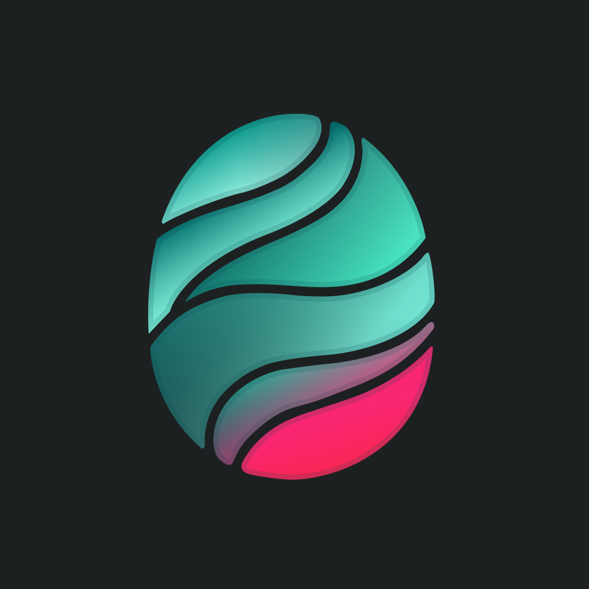
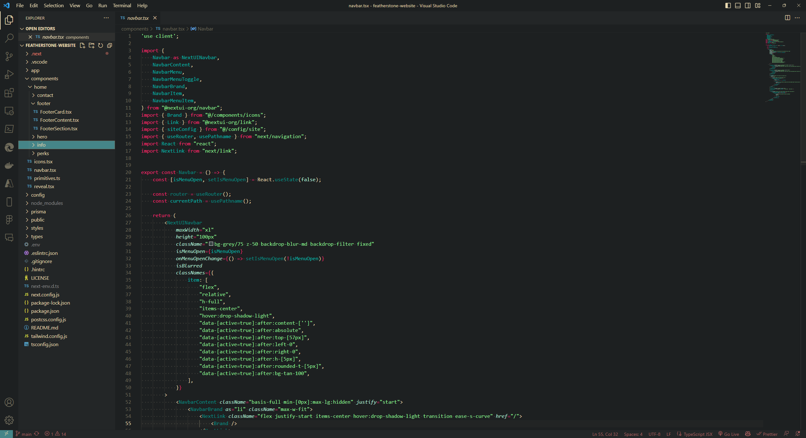
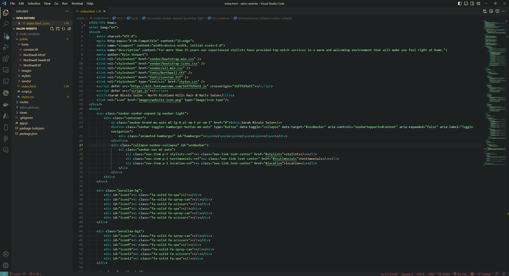
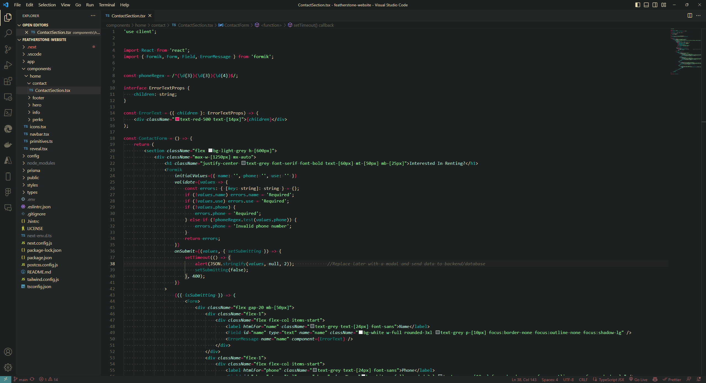
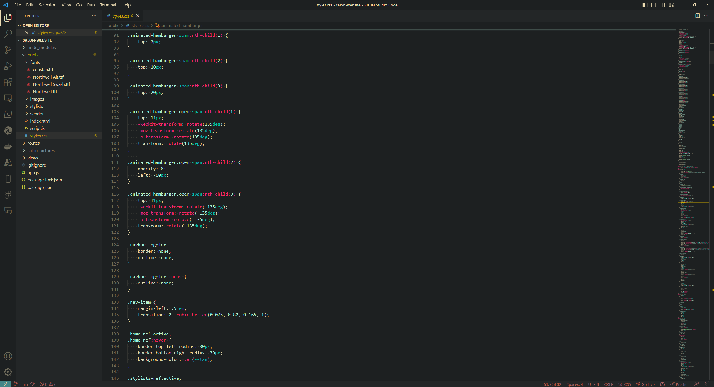

# Sea Glass Theme

A VSCode dark theme inspired by sea glass.

---



---



---



---



## Installation

1. Open **Extensions** sidebar panel in VS Code. `View → Extensions`
2. Search for `Sea Glass Theme`
3. Click **Install**
4. Click **Reload**
5. File > Preferences > Color Theme > **Sea Glass Theme**

## Tips

- This theme was created initially with languages like JavaScript, TypeScript, HTML, and CSS in mind. Therefore if you are using a language or framework that is not properly supported, please open an issue on the [Sea Glass Theme Github Repo](https://github.com/KStew1017/sea-glass-vscode-color-theme) and I will try to add support for it.

- With colorized bracket pairs now a native feature in VSCode, I recommend disabling them in your settings for a cleaner look. To do this, open your `settings.json` file by pressing `Ctrl + Shift + P` and typing `Preferences: Open User Settings (JSON)`. Then add the following line anywhere in your settings file:

```json
"editor.language.colorizedBracketPairs": [],
```

## Contributing

If you'd like to contribute to this theme or make any suggestions, please do so [here](https://github.com/KStew1017/sea-glass-vscode-color-theme).

## Inspiration

This theme was inspired by the [Gruvbox Theme](https://marketplace.visualstudio.com/items?itemName=jdinhlife.gruvbox).

## License

[MIT License](./LICENSE.txt)

## Credits

This theme was created by [Kyle Stewart](https://github.com/KStew1017).

---

Please rate and share if you like this theme. Thanks!

**Enjoy!**